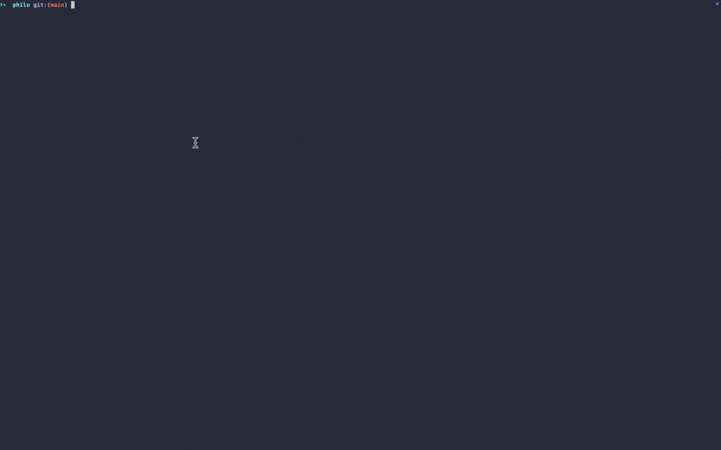

# Philosophers

## Projet

You have to write a program for the mandatory part and another one for the bonus part
(if you decide to do the bonus part). They both have to comply with the following rules:
• Global variables are forbidden!
• Your(s) program(s) should take the following arguments:
number_of_philosophers time_to_die time_to_eat time_to_sleep
[number_of_times_each_philosopher_must_eat]
◦ number_of_philosophers: The number of philosophers and also the number
of forks.
◦ time_to_die (in milliseconds): If a philosopher didn’t start eating time_to_die
milliseconds since the beginning of their last meal or the beginning of the simulation, they die.
◦ time_to_eat (in milliseconds): The time it takes for a philosopher to eat.
During that time, they will need to hold two forks.
◦ time_to_sleep (in milliseconds): The time a philosopher will spend sleeping.
◦ number_of_times_each_philosopher_must_eat (optional argument): If all
philosophers have eaten at least number_of_times_each_philosopher_must_eat
times, the simulation stops. If not specified, the simulation stops when a
philosopher dies.
• Each philosopher has a number ranging from 1 to number_of_philosophers.
• Philosopher number 1 sits next to philosopher number number_of_philosophers.
Any other philosopher number N sits between philosopher number N - 1 and philosopher number N + 1.

## Preview

## License

MIT License
Copyright (c) 2024 Jérémy Lorette
